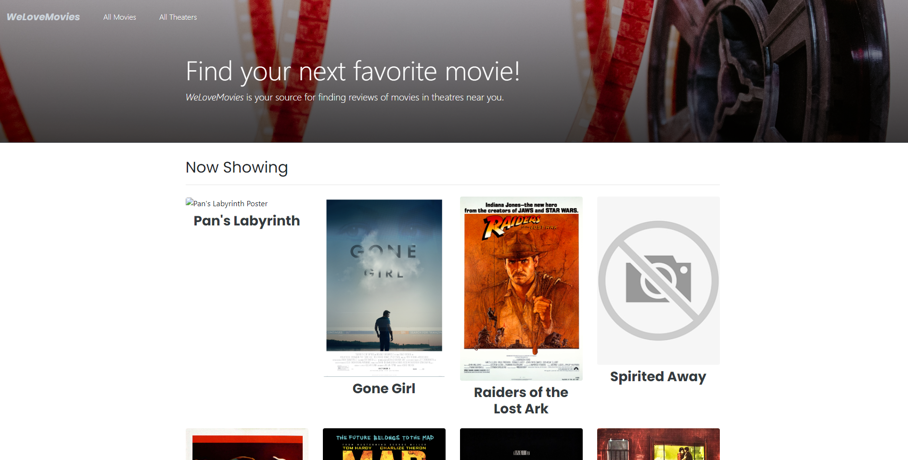

# Project Name: WeLoveMovies Frontend Application

Live site: https://we-love-movie-b8dk.onrender.com

## Description
Whatever routes the user choose, the app will access data through database and provide the information of movies, theaters, and reviews accordingly. 

## Techonology Used
 - Full stack management system.
 - Implemented react router and express to build a RESTful API in order to make HTTP requests for all of the movies data stored on the connected PostgreSQL database.
 - Created CRUD functions and Knex queries to handle data going to and coming from the database.
 - Used Git to track changes and versions while keeping sensitive information from being pushed to repositories.
 - Used bootstrap to styling the webpage.
 - Technology: React, Node.js, Express, Knex, and PostgreSQL.

## Installation instructions
1. Fork and clone this repository and the backend server repository.
2. Run npm install to install project dependencies.
